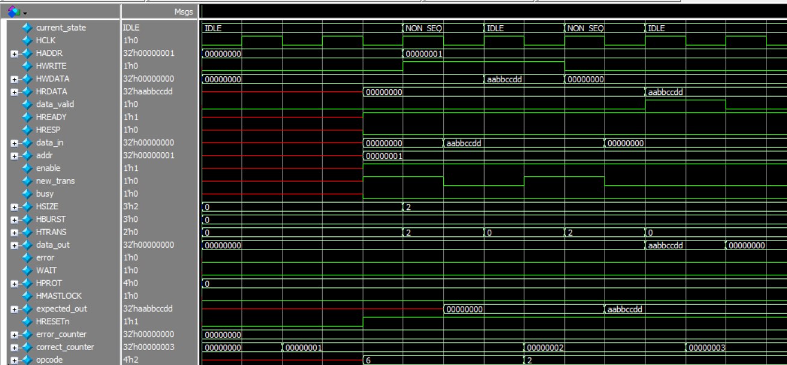

# AMBA_3_AHB-Lite_Protocol
## system block diagram

## Master interface
 

## STATE DIAGRAM 
   

 ## opcode
 |SIGNAL    | Description |
 |:--------:|:--------:|
 |opcode[3] | if high this transfer is burst if low this transfer is single   |
 |opcode[2] | if high Write  if low read|
 |opcode[1:0] | 00 for byte transfers 01 for half word 10 for word 11 means UART operation (size is byte) |

 ## FEATURES NOT INCLUDED

 * HPROT
 * HMASTLOCK
 * HBURST
    1. WRAP4
    2. INCR4
    3. WRAP8
    4. INCR8
    5. WRAP16
    6. INCR16
   
## TEST CASES
### simple read or write

### consecutive with wait state

### simple burst 

### burst with busy state
 
### error
 

